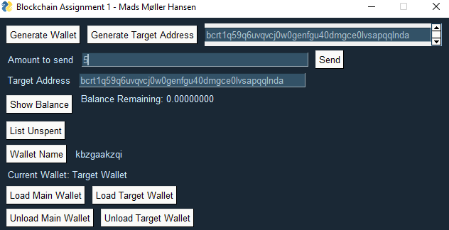

#Bitcoin Core Application with GUI

Make sure to run the shutdown.py script followed by the startup.py script to run the application. 

Delete the "regtest" folder in AppData/Roaming/Bitcoin to clear the regtest environment.

