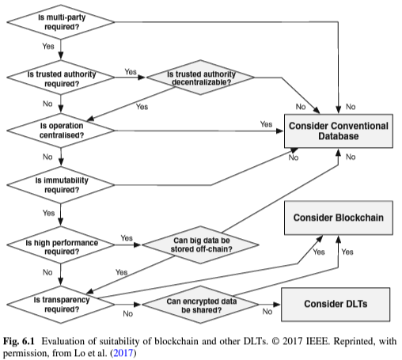
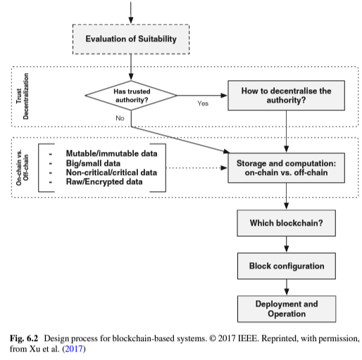

# Assignment 3 - Hyperledger Fabric 

## **Use-case: Electronic Voting Application** 

Transparency is an important part of the voting application use case. Both voters and auditors need to have an idea of what's happening. 
Secure. It must be secure to avoid any misconduct from happening. 
Avoid double spending. Voters should not be allowed to vote more than once.
Performance and scalability. It has to be scalable to the required capacity, and perform at an acceptable level, to be a suitable solution.
Simplistic. It has to be simple enough so that ordinary users can participate.
Eligibility. It has to ensure that the ones casting the votes, are actually eligible to vote.
Confidentiality, Integrity, Availability (CIA). 
Confidentiality: Anonymity in votes, but not the voters. Information regarding what was voted can not be shared, but who has voted must be available.
Integrity: It’s important that the integrity is intact, because without integrity, the results are meaningless
Availability: It has to have high availability, so that the users can cast their votes without problem.

### **1. Evaluation Analysis**
| Architecture or Blockchain Characteristic | Weight | Subjective Percentage of Affirmation | Weight Affirmation |
|-------------------------------------------|--------|--------------------------------------|--------------------|
| Immutability                              | 8      | 75%                                  | 6                  |
| Transparency                              | 14     | 100%                                 | 14                 |
| Trust                                     | 16     | 75%                                  | 12                 |
| Identity                                  | 14     | 100%                                 | 14                 |
| Distribution                              | 5      | 100%                                 | 5                  |
| Workflow                                  | 5      | 15%                                  | 0.75               |
| Transactions                              | 10     | 100%                                 | 10                 |
| Historical Record                         | 10     | 50%                                  | 5                  |
| Ecosystem                                 | 10     | 100%                                 | 10                 |
| Inefficiency                              | 8      | 100%                                 | 8                  |
| Total Percentage of Fit                   | 100    | 81.5%                                | 84.75/100          |

### **2. Criteria Analysis**

* **Will this project require updates, mutability or deletion of records?**  
Most likely not. The voting system follows a simple transactional model without double spending. A change in law could potentially require an update to the architecture, but we find it very unlikely. 

* **Is there agreement that all blockchain participants should be able to view and validate    transaction details?**  
Yes, however, transaction details are obfuscated and unreadable. This means that there is no way to figure out what people have voted for.

* **Does this architecture fit well in an ecosystem of diverse participants?**  
Yes. Each participant should be able to vote by mail, so there is no difference between the participants. 

* **Are there adequate incentives for participants to continue to support the chain indefinitely?**  
Yes. Whenever there is a vote, each individual would like to use their vote just like they would in a traditional system. Voting by mail would also be a quicker option for the voter.

* **From an efficiency perspective, are there enough participants and sufficient complexity to buoy the consensus model, validate all transactions, and approve the authentication and authorization processes?**  
A voting system could have as many participants as the entire country's eligible voter population. It would also be hosted by the state, and funded through tax money, ensuring enough resources to process everything.

### **3. Suitability Analysis**

Multi-party is a requirement since the political system requires political parties across the political spectrum to run for elections. There is no trusted authority required, as long as storage and computation is handled on-chain, where it is immutable which is definitely a requirement in order to run a fair vote. High performance is believed to be necessary since a lot of votes are expected at a very fast pace, depending on the voting environment (district, country etc.). High performance is usually not guaranteed in blockchain technology, however, with frameworks such as Hyperledger Fabric we can deploy permissioned high-performance blockchains. This is among more because we can choose consensus mechanisms depending on specific use-cases. Transparency is a requirement for voters to get insight in the voting process. Voters should be identifiable, but actual votes should not. Without transparency a blockchain implementation is no better than a traditional voting system from an end-user point of view. Finally we land on a blockchain implementation, and we can now suggest an architecture based on our use-case.

### **4. Designing the Hyperledger Fabric Blockchain**

Now that we have somewhat argued for the suitability of blockchain, we can use the above design framework to figure out the architecture of the solution. With an e-voting system there is no need for a trusted authority, as long as all computation and storage is on-chain. On-chain is advantageous over off-chain both for storage and computation in high-risk voting systems, because then all votes and counts are immutable and transparent. Off-chain computation is faster than off-chain, however, we find the security aspect very essential. All participants are supposed to be identifiable while their votes should be unidentifiable. This speaks for a private/permissioned blockchain implementation. The block configuration would depend on the environment the blockchain is implemented in. The batch-size and batch-time should be configured so that the transactions per second (TPS) are high enough to finish the voting count within 24 hours of the individual votes.